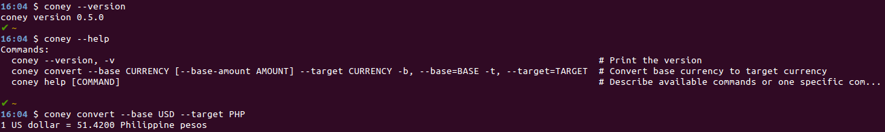

# coney [](https://semaphoreci.com/wnuqui/coney) [](https://ebertapp.io/github/wnuqui/coney) <a href="https://codeclimate.com/github/wnuqui/coney"></a> <a href="https://codeclimate.com/github/wnuqui/coney"></a> <a href="https://codeclimate.com/github/wnuqui/coney/coverage"></a>

This gem is a CLI application that can be used to convert currency from base to target via Google.

## Installation

```shell
gem install coney
```

## Usage

    $ coney convert --base=USD --base-amount=10 --target=EURO

## In action



## Development

To install this gem onto your local machine, run `bundle exec rake install`. To release a new version, update the version number in `version.rb`, and then run `bundle exec rake release`, which will create a git tag for the version, push git commits and tags, and push the `.gem` file to [rubygems.org](https://rubygems.org).

## Contributing

Bug reports and pull requests are welcome on GitHub at https://github.com/wnuqui/coney. This project is intended to be a safe, welcoming space for collaboration, and contributors are expected to adhere to the [Contributor Covenant](http://contributor-covenant.org) code of conduct.


## License

The gem is available as open source under the terms of the [MIT License](http://opensource.org/licenses/MIT).
