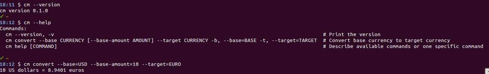

# cm [](https://semaphoreci.com/wnuqui/cm) [](https://ebertapp.io/github/wnuqui/cm)

This gem is a CLI application that can be used to convert currency from base to target via Google.

## Installation

There is already a gem of same name here: https://github.com/adrianwebb/cm. To install, do the following:

```shell
git clone git://github.com/wnuqui/cm.git && cd cm
bundle && rake spec && rake clean clobber install:local
```

## Usage

    $ cm convert --base=USD --base-amount=10 --target=EURO

## In action



## Development

After checking out the repo, run `bin/setup` to install dependencies. Then, run `rake spec` to run the tests. You can also run `bin/console` for an interactive prompt that will allow you to experiment.

To install this gem onto your local machine, run `bundle exec rake install`. To release a new version, update the version number in `version.rb`, and then run `bundle exec rake release`, which will create a git tag for the version, push git commits and tags, and push the `.gem` file to [rubygems.org](https://rubygems.org).

## Contributing

Bug reports and pull requests are welcome on GitHub at https://github.com/wnuqui/cm. This project is intended to be a safe, welcoming space for collaboration, and contributors are expected to adhere to the [Contributor Covenant](http://contributor-covenant.org) code of conduct.


## License

The gem is available as open source under the terms of the [MIT License](http://opensource.org/licenses/MIT).
